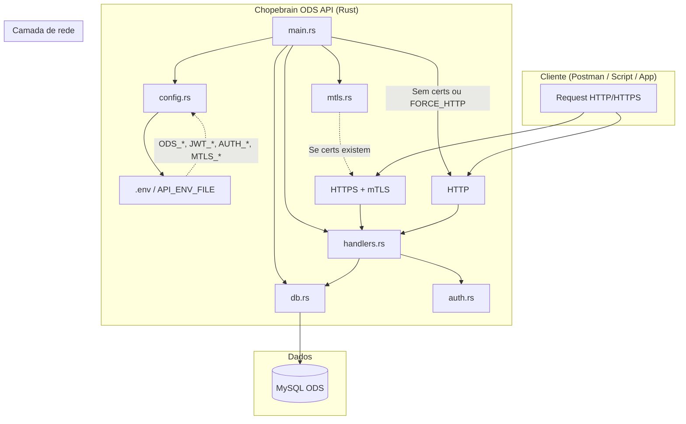
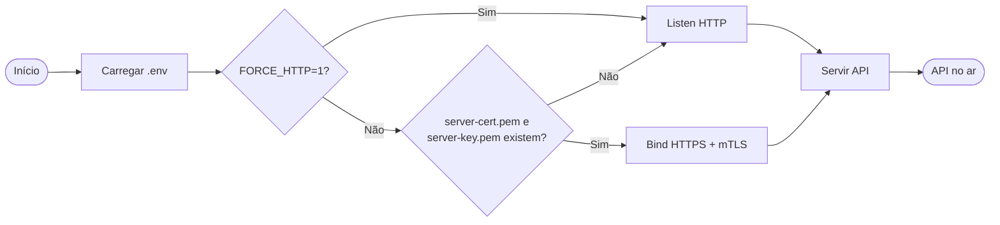
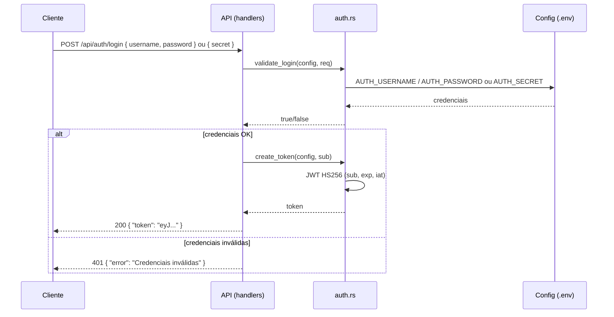
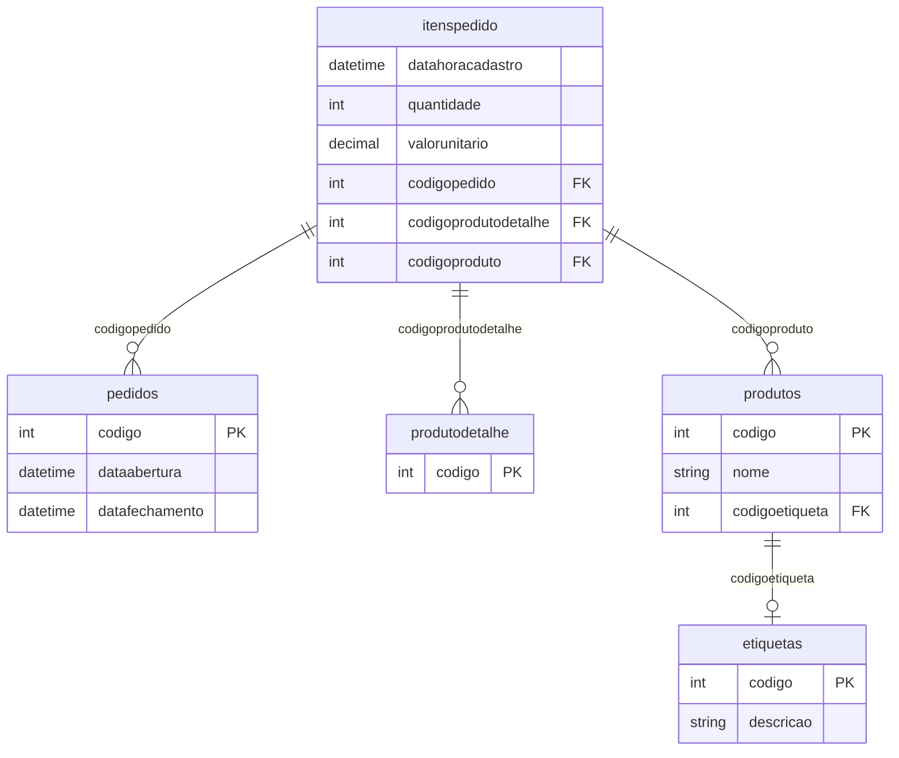
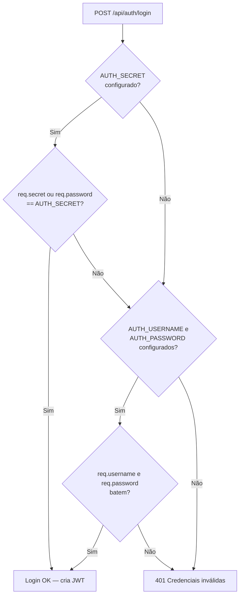
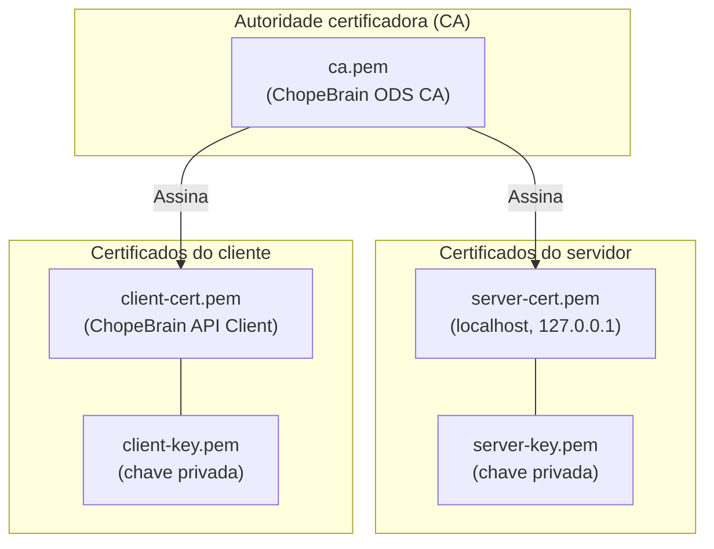
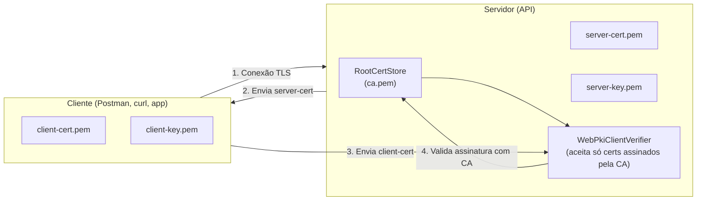
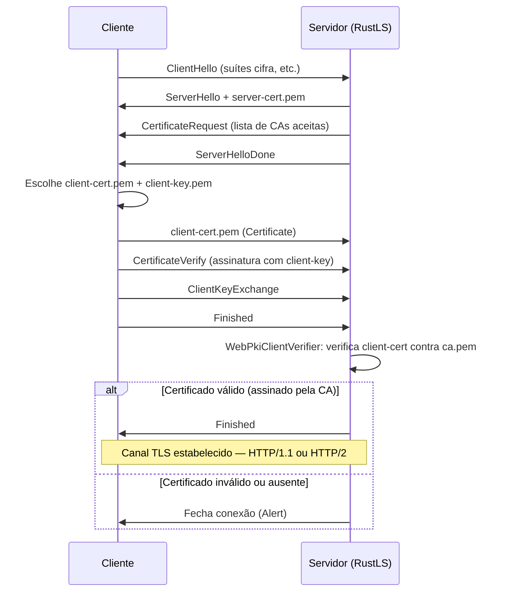
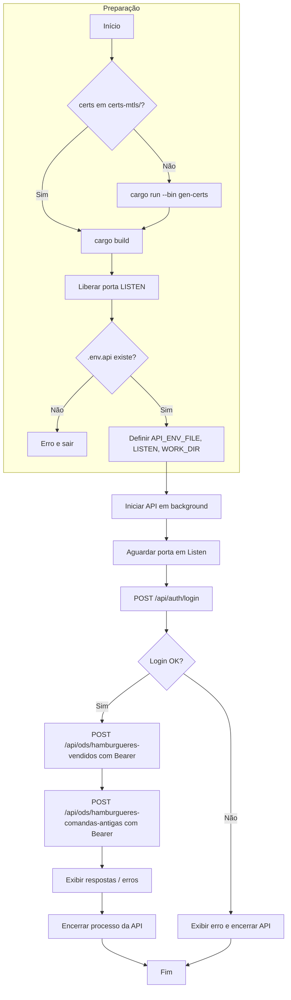

# Documentação completa — Chopebrain ODS API

API em Rust para o **ODS (Operational Data Store)** da Choperia: autenticação JWT, mTLS opcional e endpoints de relatórios de hambúrgueres (vendidos no mês e comandas antigas).

---

## 1. Visão geral

- **Objetivo:** Expor dados do banco MySQL do ODS via API REST, com autenticação e, opcionalmente, HTTPS com certificado de cliente (mTLS).
- **Stack:** Rust (edition 2021), Axum, SQLx (MySQL), JWT, RustLS (TLS).
- **Endpoints:**
  - `POST /api/auth/login` — Login (usuário/senha ou segredo único); retorna JWT.
  - `POST /api/ods/hamburgueres-vendidos` — Relatório de hambúrgueres vendidos no mês (requer JWT).
  - `POST /api/ods/hamburgueres-comandas-antigas` — Hambúrgueres em comandas abertas em período anterior ao mês da venda (requer JWT).

O `.env` (ou `.env.api`) fica na **raiz do repositório**, não dentro de `chopebrain-ods-api/`.

### 1.1 Diagrama de arquitetura (componentes)



### 1.2 Fluxo de decisão na inicialização (HTTP vs HTTPS)



---

## 2. Estrutura do projeto

```
rust-studies/
├── .env                    # Variáveis de ambiente (não versionado)
├── .env.api                # Alternativa para testes (ex.: scripts)
├── certs-mtls/            # Certificados mTLS (gerados por gen-certs; não versionado)
├── chopebrain-ods-api/     # Crate Rust da API
│   ├── Cargo.toml
│   ├── README.md
│   └── src/
│       ├── main.rs         # Entrypoint: carrega config, pool, sobe HTTP ou HTTPS
│       ├── lib.rs
│       ├── config.rs       # Carrega .env e Config (ODS, JWT, auth, mTLS)
│       ├── db.rs           # Pool MySQL com SSL (ODS_SSL_CA)
│       ├── auth.rs         # Login, JWT (create/decode), middleware require_jwt
│       ├── handlers.rs     # Rotas e handlers (login, hamburgueres-vendidos, comandas-antigas)
│       ├── mtls.rs        # HTTPS com mTLS (RustLS, axum-server)
│       └── bin/
│           └── gen_certs.rs  # Gera CA + server + client certs em certs-mtls/
├── scripts/
│   └── test-api.ps1       # Testes: gera certs, sobe API, login, endpoints
└── DOCUMENTACAO.md        # Este arquivo
```

---

## 3. Pré-requisitos

- **Rust** (edition 2021), com `cargo` no PATH.
- **MySQL** acessível (ODS) com as credenciais definidas no `.env`.
- Opcional: **PowerShell** 5.1+ para o script `scripts/test-api.ps1`.

---

## 4. Variáveis de ambiente

Todas as variáveis são lidas do arquivo `.env` (ou do arquivo indicado por `API_ENV_FILE`, ex.: `.env.api`). Caminhos relativos (ex.: `ODS_SSL_CA`, mTLS) são resolvidos em relação ao **diretório raiz** onde está o `.env` (`work_dir`).

### 4.1 Conexão MySQL (ODS)

| Variável       | Obrigatório | Descrição |
|----------------|-------------|-----------|
| `ODS_HOST`     | Sim         | Host do MySQL (ex.: `seu-servidor.mysql.database.azure.com`) |
| `ODS_PORT`     | Não         | Porta (padrão: `3306`) |
| `ODS_USER`     | Sim         | Usuário MySQL |
| `ODS_PASSWORD` | Sim         | Senha MySQL |
| `ODS_NAME`     | Sim         | Nome do banco de dados |
| `ODS_SSL_CA`   | Não         | Caminho para o certificado CA (ex.: `./certs/DigiCertGlobalRootCA.crt.pem`) para SSL na conexão |

### 4.2 JWT

| Variável             | Obrigatório | Descrição |
|----------------------|-------------|-----------|
| `JWT_SECRET`         | Não         | Segredo para assinar o token (padrão: `change-me-in-production`) |
| `JWT_EXPIRATION_DAYS`| Não         | Dias até expiração do token (padrão: `7`) |

### 4.3 Autenticação (login)

É necessário configurar **um** dos modos:

- **Usuário e senha:**  
  `AUTH_USERNAME` e `AUTH_PASSWORD`. O cliente envia `{ "username": "...", "password": "..." }`.

- **Segredo único:**  
  `AUTH_SECRET`. O cliente pode enviar `{ "secret": "valor" }` ou `{ "password": "valor" }` (ou username + password com a senha igual ao segredo).

### 4.4 mTLS (HTTPS + certificado de cliente)

| Variável            | Obrigatório | Descrição |
|---------------------|-------------|-----------|
| `MTLS_SERVER_CERT`  | Não         | Caminho do certificado do servidor (padrão: `./certs-mtls/server-cert.pem`) |
| `MTLS_SERVER_KEY`   | Não         | Caminho da chave privada do servidor (padrão: `./certs-mtls/server-key.pem`) |
| `MTLS_CA_CERT`      | Não         | Caminho do CA para validar certificados de cliente (padrão: `./certs-mtls/ca.pem`) |
| `FORCE_HTTP`        | Não         | Se `1`, desativa mTLS e sobe só HTTP (útil para testes locais) |

Se os arquivos de servidor (cert + key) existirem e `FORCE_HTTP` não for `1`, a API sobe em **HTTPS com mTLS** (cliente deve apresentar certificado aceito pela CA).

### 4.5 Servidor e diretório de trabalho

| Variável         | Obrigatório | Descrição |
|------------------|-------------|-----------|
| `LISTEN`         | Não         | Endereço e porta (padrão: `0.0.0.0:3000`), ex.: `127.0.0.1:30443` |
| `WORK_DIR`       | Não         | Diretório raiz onde está o `.env` (inferido automaticamente se não definido) |
| `API_ENV_FILE`   | Não         | Caminho absoluto ou relativo para um arquivo `.env` alternativo (ex.: `.env.api`) |
| `CERT_OUTPUT_DIR`| Não         | Diretório de saída do binário `gen-certs` (padrão: `./certs-mtls` em relação ao work_dir) |

### 4.6 Logs

| Variável   | Descrição |
|------------|-----------|
| `RUST_LOG` | Níveis de log (padrão: `chopebrain_ods_api=debug,tower_http=debug,info`) |

---

## 5. Como executar

### 5.1 Carregamento do .env

1. Se `API_ENV_FILE` estiver definido e for um arquivo, esse arquivo é carregado e o `work_dir` é o diretório do arquivo.
2. Se `WORK_DIR` estiver definido e existir `.env` nesse diretório, esse `.env` é usado.
3. Caso contrário, a API procura `.env` no diretório atual e em diretórios pais.

Recomendação: na raiz do repositório, ter um `.env` (ou usar `API_ENV_FILE` apontando para `.env.api` em testes).

### 5.2 Gerar certificados mTLS

Na raiz do repositório (ou com `WORK_DIR`/`API_ENV_FILE` adequados):

```bash
cargo run --manifest-path chopebrain-ods-api/Cargo.toml --bin gen-certs
```

Arquivos gerados em `./certs-mtls/` (ou em `CERT_OUTPUT_DIR`):

- `ca.pem` — Autoridade certificadora
- `server-cert.pem`, `server-key.pem` — Servidor (localhost / 127.0.0.1)
- `client-cert.pem`, `client-key.pem` — Cliente (Postman, script, etc.)

### 5.3 Subir a API

Na raiz do repositório:

```bash
cargo run --manifest-path chopebrain-ods-api/Cargo.toml
```

Ou de dentro de `chopebrain-ods-api/`:

```bash
cd chopebrain-ods-api
# PowerShell:
$env:WORK_DIR = ".."
# Bash:
# export WORK_DIR=..
cargo run
```

- Sem certificados mTLS (ou com `FORCE_HTTP=1`): **HTTP** em `http://0.0.0.0:3000` (ou o valor de `LISTEN`).
- Com certificados mTLS: **HTTPS** no mesmo endereço, exigindo certificado de cliente.

---

## 6. API — Endpoints

Base URL: `http://<host>:<port>` ou `https://<host>:<port>` conforme o modo.

### 6.1 POST /api/auth/login

**Autenticação:** Nenhuma.

**Request (JSON):**

- Modo usuário/senha: `{ "username": "usuario", "password": "senha" }`
- Modo segredo: `{ "secret": "valor_do_AUTH_SECRET" }` ou `{ "password": "valor_do_AUTH_SECRET" }`

**Resposta 200:**

```json
{ "token": "eyJ0eXAiOiJKV1QiLCJhbGc..." }
```

**Erros:** `401` — credenciais inválidas; `500` — erro ao gerar JWT.

**Sequência (login):**



---

### 6.2 POST /api/ods/hamburgueres-vendidos

**Autenticação:** `Authorization: Bearer <token>`. Em HTTPS com mTLS, também é necessário certificado de cliente.

**Request (JSON):**

```json
{ "mes": "2026-01" }
```

`mes` no formato **YYYY-MM**.

**Resposta 200:**

```json
{
  "totais": {
    "quantidade": 120,
    "valor": 4567.89,
    "ticket_medio": 38.07
  },
  "por_categoria": [
    { "categoria": "Hamburguer", "quantidade": 80, "valor": 3000.00 },
    { "categoria": null, "quantidade": 40, "valor": 1567.89 }
  ],
  "por_produto": [
    { "produto": "X-Tudo", "categoria": "Hamburguer", "quantidade": 45, "valor": 1800.00 }
  ],
  "itens": [
    {
      "data_venda_item": "2026-01-15 12:30",
      "pedido": 12345,
      "produto": "X-Tudo",
      "categoria": "Hamburguer",
      "quantidade": 1,
      "valor": 40.00
    }
  ]
}
```

- **totais:** quantidade total de itens (hambúrgueres), valor total e ticket médio.
- **por_categoria:** agregado por categoria (etiqueta).
- **por_produto:** até 10 produtos com maior quantidade.
- **itens:** lista de itens de venda no mês.

**Erros:** `400` — `mes` inválido (ex.: não YYYY-MM); `401` — token ausente/inválido; `500` — erro de banco (mensagem em `error`).

**Sequência (endpoint protegido, com ou sem mTLS):**

```mermaid
sequenceDiagram
    participant C as Cliente
    participant TLS as Camada TLS (se mTLS)
    participant M as Middleware require_jwt
    participant H as Handler (hamburgueres_*)
    participant DB as MySQL ODS

    C->>TLS: HTTPS Request (opcional: client cert)
    note over TLS: Se mTLS: valida client cert contra CA
    TLS->>M: Request + Authorization: Bearer &lt;token&gt;
    M->>M: decode_token(secret, token)
    alt token válido
        M->>H: next.run(request)
        H->>H: parse_mes("YYYY-MM")
        H->>DB: Queries (itenspedido, pedidos, produtos, etiquetas)
        DB-->>H: Rows
        H-->>M: Json(response)
        M-->>TLS: 200 + JSON
        TLS-->>C: Response
    else token ausente/inválido/expirado
        M-->>C: 401 { "error": "..." }
    end
```

---

### 6.3 POST /api/ods/hamburgueres-comandas-antigas

**Autenticação:** `Authorization: Bearer <token>`. Em HTTPS com mTLS, certificado de cliente obrigatório.

**Request (JSON):**

```json
{ "mes": "2026-01" }
```

Considera itens **vendidos no mês** indicado, mas em **pedidos (comandas) abertos em período anterior** (ano anterior ou mesmo ano com mês anterior).

**Resposta 200:**

```json
{
  "totais": {
    "quantidade": 15,
    "valor": 580.00,
    "ticket_medio": 38.67
  },
  "por_produto": [
    { "produto": "X-Bacon", "categoria": "Hamburguer", "quantidade": 8, "valor": 320.00 }
  ],
  "por_pedido": [
    {
      "pedido_id": 12001,
      "data_abertura": "2025-12-10 18:00",
      "data_fechamento": "2026-01-05 22:00",
      "itens": 3,
      "quantidade": 5,
      "valor": 195.00
    }
  ],
  "detalhamento": [
    {
      "data_venda_item": "2026-01-02 14:20",
      "pedido": 12001,
      "data_abertura": "2025-12-10",
      "dias_diferenca": 23,
      "produto": "X-Bacon",
      "quantidade": 2,
      "valor": 80.00
    }
  ]
}
```

**Erros:** mesmos códigos que em hamburgueres-vendidos.

---

## 7. Regra de “hambúrguer”

Um item entra nos relatórios de hambúrgueres se:

- A **categoria** (etiqueta) for `Hamburger` ou `Hamburguer` (case insensitive), **ou**
- O **nome do produto** contiver (case insensitive) uma das palavras-chave:  
  `hamburguer`, `burger`, `cheeseburger`, `bacon burger`, `frango burger`, `artesanal burger`.

Isso é aplicado em todas as queries dos dois endpoints ODS (filtro `HAMBURGER_CATEGORY_FILTER` em `handlers.rs`).

---

## 8. Banco de dados (ODS)

- **Motor:** MySQL.
- **Conexão:** SSL opcional via `ODS_SSL_CA` (modo Verify CA).

Tabelas utilizadas (nomes e colunas conforme implementação atual):

- **itenspedido:** `datahoracadastro`, `quantidade`, `valorunitario`, `codigopedido`, `codigoprodutodetalhe`, `codigoproduto`
- **pedidos:** `codigo`, `dataabertura`, `datafechamento`
- **produtodetalhe:** `codigo`
- **produtos:** `codigo`, `nome`, `codigoetiqueta`
- **etiquetas:** `codigo`, `descricao`

Os JOINs usam `codigo` / `codigopedido` / `codigoproduto` / `codigoetiqueta` conforme o schema do ODS.

### 8.1 Diagrama de relações (endpoints de hambúrgueres)



Fluxo lógico das queries: **itenspedido** (filtro por ano/mês em `datahoracadastro`) → **pedidos** (para comandas antigas: `dataabertura` em período anterior) → **produtodetalhe** → **produtos** → **etiquetas** (categoria). O filtro de “hambúrguer” é aplicado em `etiquetas.descricao` e `produtos.nome`.

---

## 9. Autenticação JWT

- **Algoritmo:** HS256 (segredo em `JWT_SECRET`).
- **Claims:** `sub` (identificador do usuário, ex.: username ou `"api"`), `exp`, `iat`.
- **Uso:** Header `Authorization: Bearer <token>` em todos os endpoints protegidos. O middleware `require_jwt` em `auth.rs` valida o token e rejeita com `401` se estiver ausente, inválido ou expirado.

### 9.1 Validação do login (validate_login)

O handler de login aceita dois modos de credencial; a ordem de checagem é a abaixo.



---

## 10. mTLS (HTTPS + certificado de cliente) — detalhado

**mTLS (mutual TLS)** é TLS com autenticação bilateral: além do servidor se identificar com seu certificado (HTTPS normal), o **cliente** também precisa apresentar um certificado assinado por uma CA em que o servidor confia. Assim, só clientes que possuem um certificado válido conseguem estabelecer a conexão.

### 10.1 Hierarquia de certificados (gen-certs)

O binário `gen-certs` gera uma **CA (Certificate Authority)** autoassinada e, a partir dela, o certificado do servidor e o do cliente. Tudo fica em `certs-mtls/`.



| Arquivo           | Quem usa        | Uso |
|-------------------|----------------|-----|
| `ca.pem`          | Servidor       | Monta o **RootCertStore** para validar o certificado que o **cliente** envia. |
| `server-cert.pem` | Servidor       | Enviado ao cliente na handshake TLS (identidade do servidor). |
| `server-key.pem`  | Servidor       | Chave privada para decifrar e assinar (nunca enviada). |
| `client-cert.pem` | Cliente        | Enviado ao servidor na handshake (identidade do cliente). |
| `client-key.pem`  | Cliente        | Chave privada do cliente (nunca enviada). |

### 10.2 Quem usa o quê (visão geral)



1. **Cliente** inicia conexão TLS ao servidor.
2. **Servidor** envia `server-cert.pem`; o cliente (opcionalmente) verifica contra uma CA de confiança — em teste com CA autoassinada pode desativar verificação.
3. **Servidor** pede o certificado do cliente (mTLS).
4. **Cliente** envia `client-cert.pem` (assinado com `client-key.pem`).
5. **Servidor** usa `ca.pem` no `WebPkiClientVerifier`: só aceita se o certificado do cliente for assinado por essa CA. Se não for, a conexão é encerrada antes de qualquer HTTP.

### 10.3 Handshake TLS com certificado de cliente (sequência)



- **CertificateRequest:** o servidor indica que exige certificado de cliente e pode enviar a lista de CAs aceitas (no nosso caso, a CA de `ca.pem`).
- **CertificateVerify:** o cliente prova que possui a chave privada correspondente ao `client-cert.pem`.
- **WebPkiClientVerifier:** no servidor (código em `mtls.rs`), usa `RootCertStore` carregado com `ca.pem`; só certificados assinados por essa CA são aceitos.

### 10.4 Fluxo no código (mtls.rs)

```mermaid
flowchart TB
    A[main: mtls_enabled?] --> B{server-cert.pem e\nserver-key.pem existem?}
    B -->|Não ou FORCE_HTTP=1| C[Bind HTTP]
    B -->|Sim| D[Carregar server-cert.pem, server-key.pem]
    D --> E[Carregar ca.pem]
    E --> F[RootCertStore.add(ca)]
    F --> G[WebPkiClientVerifier::builder(root_store).build()]
    G --> H[ServerConfig com client_verifier]
    H --> I[axum_server::bind_rustls]
    I --> J[Servir HTTPS com mTLS]
```

- **RustLS** usa `ServerConfig` com `with_client_cert_verifier(client_verifier)`, então toda conexão precisa passar pela validação do certificado do cliente antes de chegar ao Axum.

### 10.5 Quando mTLS está ativo

- **Condição:** existência de `server-cert.pem` e `server-key.pem` (caminhos padrão `./certs-mtls/` ou variáveis `MTLS_SERVER_CERT` / `MTLS_SERVER_KEY`) **e** `FORCE_HTTP` ≠ `1`.
- **Comportamento:** o servidor escuta em HTTPS e **exige** certificado de cliente assinado pela CA (`ca.pem`). Sem certificado válido, a conexão TLS é recusada (não chega a retornar 401 HTTP).

### 10.6 Uso no Postman

1. **Settings** (ou na requisição) → **Certificate**.
2. Ativar **Client Certificate**.
3. **Certificate:** arquivo `client-cert.pem`.
4. **Private Key:** arquivo `client-key.pem`.
5. Em ambiente de teste com CA autoassinada, pode ser necessário desativar **SSL certificate verification** para o host.

### 10.7 Script de testes e FORCE_HTTP

Em alguns ambientes (ex.: PowerShell 5.1 no Windows) o uso de certificado cliente em PEM com `Invoke-RestMethod` ou `curl.exe` é limitado. O script pode definir `FORCE_HTTP=1` e `API_ENV_FILE` para subir a API em **HTTP** e testar apenas login e payloads dos endpoints, sem mTLS.

---

## 11. Script de testes (PowerShell)

**Arquivo:** `scripts/test-api.ps1`  
**Uso:** Executar na raiz do repositório: `.\scripts\test-api.ps1`

### 11.1 Fluxo do script (resumo)



O script:

1. Gera certificados em `certs-mtls/` se ainda não existirem (`gen-certs`).
2. Faz build da API.
3. Libera a porta configurada (ex.: 30443) se estiver em uso.
4. Cria/usa `.env.api` na raiz (variáveis mínimas: ODS_*, JWT_*, AUTH_SECRET). Define `API_ENV_FILE`, `LISTEN`, `WORK_DIR` e, em alguns ambientes, `FORCE_HTTP=1` para usar HTTP.
5. Inicia a API em background.
6. Aguarda a porta em escuta e faz:
   - Login em `POST /api/auth/login` (segredo ou usuário/senha conforme `.env.api`).
   - Chamadas a `hamburgueres-vendidos` e `hamburgueres-comandas-antigas` com o token.
7. Exibe respostas e, em caso de erro, o corpo da resposta (ex.: mensagem do MySQL).
8. Encerra o processo da API ao final.

Variáveis úteis no ambiente antes de rodar o script:

- `TEST_API_HTTP=1` — força uso de HTTP para os testes.
- `AUTH_SECRET` — segredo de login (se não estiver em `.env.api`).

---

## 12. Logs e troubleshooting

- **Logs:** `tracing` com nível padrão `chopebrain_ods_api=debug,tower_http=debug,info`. Ajuste com `RUST_LOG`.
- **Erros internos:** Em falhas de handler (ex.: MySQL), a API retorna JSON `{ "error": "mensagem" }` e registra causa e, em build debug, backtrace.
- **Configuração:** Se a API não encontrar o `.env`, verifique `WORK_DIR` ou `API_ENV_FILE` e o diretório de execução.
- **mTLS:** Se quiser forçar HTTP (ex.: testes sem certificado cliente), use `FORCE_HTTP=1`.
- **Porta em uso:** Altere `LISTEN` ou, no script, a variável `$ListenPort` e garanta que nenhum outro processo use a porta.

---

## 13. Resumo rápido

| Ação | Comando / Observação |
|------|----------------------|
| Carregar config | `.env` (ou `API_ENV_FILE`) na raiz do repo |
| Gerar certs mTLS | `cargo run --manifest-path chopebrain-ods-api/Cargo.toml --bin gen-certs` |
| Subir API | `cargo run --manifest-path chopebrain-ods-api/Cargo.toml` (na raiz) |
| Testar com script | `.\scripts\test-api.ps1` (raiz); requer `.env.api` com ODS_*, JWT_*, AUTH_* |
| Login | `POST /api/auth/login` com `username`/`password` ou `secret` |
| Endpoints ODS | `POST /api/ods/hamburgueres-vendidos` e `.../hamburgueres-comandas-antigas` com body `{ "mes": "YYYY-MM" }` e header `Authorization: Bearer <token>` |

Para mais detalhes do dia a dia (Postman, exemplos de body), consulte o `README.md` dentro de `chopebrain-ods-api/`.
