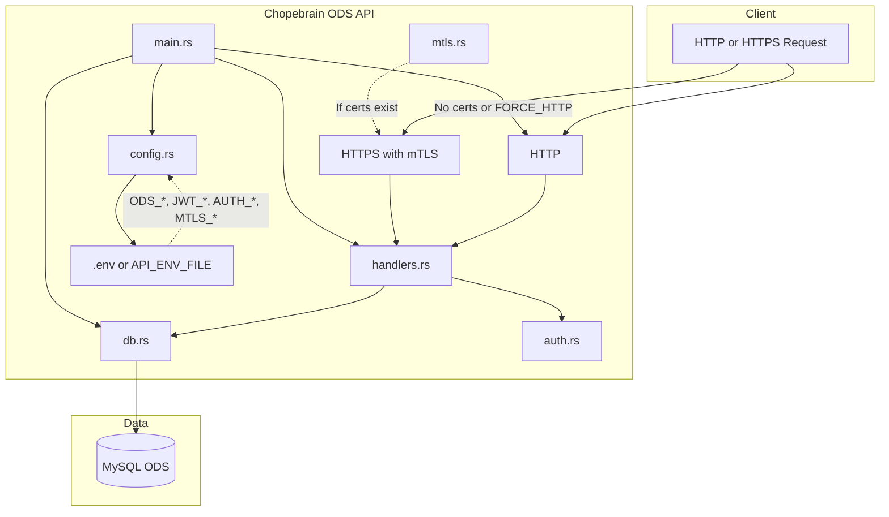
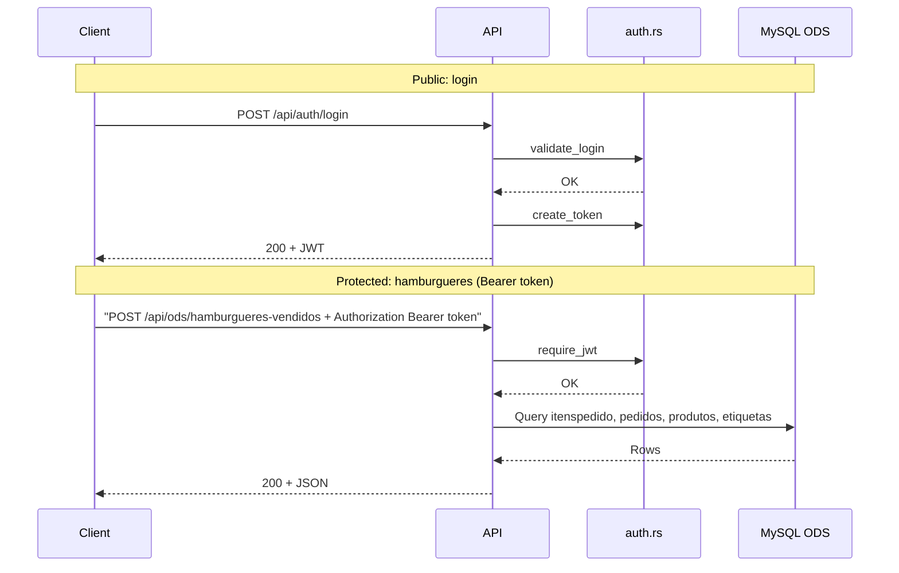
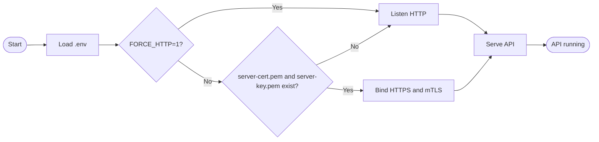

# rust-studies · Chopebrain ODS API

**REST API in Rust** for the Choperia ODS (Operational Data Store): JWT auth, optional mTLS, and burger-sales endpoints (monthly and legacy orders).

---

**API REST em Rust** para o ODS da Choperia: autenticação JWT, mTLS opcional e endpoints de hambúrgueres (vendidos no mês e comandas antigas).

---

## Features · Funcionalidades

| EN | PT |
|----|-----|
| JWT login (username/password or shared secret) | Login JWT (usuário/senha ou segredo único) |
| Optional HTTPS with mTLS (client certificate) | HTTPS opcional com mTLS (certificado de cliente) |
| MySQL ODS with SSL (e.g. Azure) | MySQL ODS com SSL (ex.: Azure) |
| Monthly burger sales report | Relatório de hambúrgueres vendidos no mês |
| Legacy-orders burger report | Relatório de hambúrgueres em comandas antigas |
| Certificate generator binary (`gen-certs`) | Binário gerador de certificados (`gen-certs`) |
| PowerShell test script | Script de testes em PowerShell |

---

## Architecture · Arquitetura



---

## Request flow · Fluxo de requisição



---

## HTTP vs HTTPS at startup · HTTP vs HTTPS na inicialização



---

## Quick start · Início rápido

### Prerequisites · Pré-requisitos

- **Rust** (edition 2021), `cargo` in PATH
- **MySQL** ODS reachable with credentials from `.env`
- `.env` at the **repository root** (not inside `chopebrain-ods-api/`)

### 1. Generate mTLS certificates (optional) · Gerar certificados mTLS (opcional)

```bash
# From repo root
cargo run --manifest-path chopebrain-ods-api/Cargo.toml --bin gen-certs
```

Output in `./certs-mtls/`: `ca.pem`, `server-cert.pem`, `server-key.pem`, `client-cert.pem`, `client-key.pem`.  
If these exist, the API starts in **HTTPS with mTLS**; otherwise it starts in **HTTP**.

### 2. Run the API · Executar a API

```bash
# From repo root (so the binary finds .env)
cargo run --manifest-path chopebrain-ods-api/Cargo.toml
```

Default: **http://0.0.0.0:3000** (or **https://0.0.0.0:3000** with mTLS). Override with `LISTEN` (e.g. `LISTEN=127.0.0.1:8443`).

### 3. Test with the script · Testar com o script

```powershell
.\scripts\test-api.ps1
```

Requires `.env.api` at repo root with `ODS_*`, `JWT_*`, and `AUTH_SECRET`. The script builds certs (if missing), starts the API, runs login and ODS endpoints, then stops the API.

---

## API overview · Visão geral da API

| Method | Path | Auth | Description |
|--------|------|------|-------------|
| POST | `/api/auth/login` | No | Login; returns JWT (username/password or `secret`) |
| POST | `/api/ods/hamburgueres-vendidos` | Bearer | Monthly burger sales (body: `{ "mes": "YYYY-MM" }`) |
| POST | `/api/ods/hamburgueres-comandas-antigas` | Bearer | Burgers in legacy orders (body: `{ "mes": "YYYY-MM" }`) |

Protected routes require header: `Authorization: Bearer <token>`. With mTLS enabled, the client must also present a certificate issued by the configured CA.

---

## Environment variables · Variáveis de ambiente

Variables are read from `.env` (or from the file set in `API_ENV_FILE`). Paths are relative to the directory that contains that file.

| Variable | Required | Description |
|----------|----------|-------------|
| `ODS_HOST` | Yes | MySQL host |
| `ODS_PORT` | No | MySQL port (default `3306`) |
| `ODS_USER` | Yes | MySQL user |
| `ODS_PASSWORD` | Yes | MySQL password |
| `ODS_NAME` | Yes | Database name |
| `ODS_SSL_CA` | No | Path to CA cert for MySQL SSL (e.g. `./certs/DigiCertGlobalRootCA.crt.pem`) |
| `JWT_SECRET` | No | Secret to sign JWTs (default `change-me-in-production`) |
| `JWT_EXPIRATION_DAYS` | No | Token expiry in days (default `7`) |
| `AUTH_USERNAME` / `AUTH_PASSWORD` | One of | Login with username and password |
| `AUTH_SECRET` | One of | Login with a single shared secret |
| `MTLS_SERVER_CERT`, `MTLS_SERVER_KEY`, `MTLS_CA_CERT` | No | mTLS paths (default `./certs-mtls/`) |
| `FORCE_HTTP` | No | Set to `1` to disable mTLS and use HTTP only |
| `LISTEN` | No | Bind address (default `0.0.0.0:3000`) |
| `WORK_DIR` | No | Root directory for `.env` (auto-detected if not set) |
| `API_ENV_FILE` | No | Path to an alternate env file (e.g. `.env.api`) |
| `CERT_OUTPUT_DIR` | No | Output directory for `gen-certs` (default `./certs-mtls`) |

---

## Project structure · Estrutura do projeto

```
rust-studies/
├── .env                    # Env vars (not committed)
├── .env.api                # Alternate env for scripts (e.g. tests)
├── certs-mtls/             # mTLS certs (gen-certs output; not committed)
├── chopebrain-ods-api/     # Rust crate
│   ├── Cargo.toml
│   ├── README.md
│   └── src/
│       ├── main.rs         # Entrypoint, HTTP/HTTPS bind
│       ├── lib.rs
│       ├── config.rs       # .env and Config (ODS, JWT, auth, mTLS)
│       ├── db.rs           # MySQL pool with SSL
│       ├── auth.rs         # Login, JWT, require_jwt middleware
│       ├── handlers.rs     # Routes and handlers
│       ├── mtls.rs         # HTTPS + mTLS (RustLS)
│       └── bin/
│           └── gen_certs.rs  # CA + server + client certs
├── scripts/
│   ├── test-api.ps1       # Run API, login, call ODS endpoints
│   └── concat_repo_all_text.py
├── DOCUMENTACAO.md         # Full documentation (PT)
└── README.md               # This file
```

---

## Full documentation · Documentação completa

Detailed docs (all endpoints, env vars, mTLS, database, troubleshooting, diagrams):  
**[DOCUMENTACAO.md](DOCUMENTACAO.md)** (Portuguese).

---

## License

Use and adapt as needed for your context.
